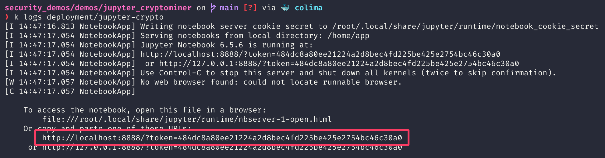

# Cryptominer via Jupyter Notebook

Simple demo using a minimal Jupyter container with 0 vulnerabilities (scanned with Trivy) and a prepared notebook.
Upon execution of all cells in the notebook, the latest version of the `XMRig` cryptominer will be downloaded from Github and executed.

The miner has no wallet configured, so no actual _mining_ will be done (possible detections based on resource utilization will not work)

## Setup

Currently, a prepared container is hosted publicly on [Docker Hub](https://hub.docker.com/repository/docker/sleshme/securitydemos/general) under a private account.
This public image is used by the `jupyter-crypto` deployment.

### Steps:
1) deploy this manifest in the target cluster where `kvisor-agent` is already setup to monitor runtime events.
    - `kubectl apply -f ./manifests/jupyter-deployment.yaml` (from the [src](https://github.com/castai-demo/security-demos/blob/master/src/) folder)
    - Notebook is exposed on port `8888`
2) create a port-forwarding to the corresponding service `kubectl port-forward svc/jupyter-crypto 8888` 
3) view the logs of the pod to get the access URL with the session token as GET parameter
  - `kubectl logs deployment/jupyter-crypto`:
  - 
4) open the notebook in the browser and open the prepared notebook `demo.ipynb`
6) execute every cell by pressing `<ctrl>+<enter>` or clicking the `Run` button
    - the outpud of the crypto miner is shown as the cell output
    - 
5) Within a few minutes after executing the Jupyter notebook, detected anomalies should appear in the Cast Console.
6) Before showing the anomalies on Runtime menu to the customer, go to the Vulnerabilities tab and show that the docker image has 0 vulnerabilities.
    - 
    The fact that there was no vulnerabilities in the image does not mean that the workload using the image is safe because the drift is introduced in the form of the jupyter notebook with
    a hidden cryptominer when executing a notebook.
    - 
6) last cell keeps retrying to run the miner, this can/should be stop by clicking the `Stop` button
